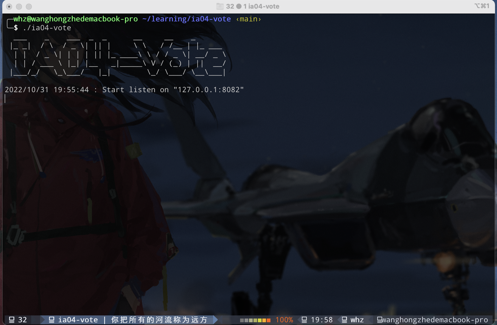
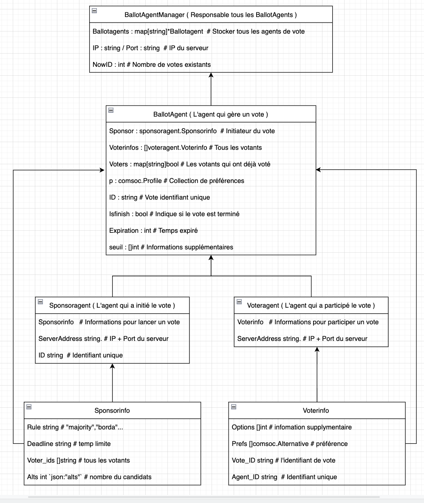

# IA04-Vote

#### Brief Introduction

Un système simple de vote, comprenant des programmes du serveur et des API de support côté client, basé sur un modèle multi-agent, qui peut initier, participer un vote et obtenir des résultats. Il prend en charge plusieurs algorithmes de vote courants.

---

#### Quick Start

##### Go Build

Clonez le code source du projet à partir du site officiel utc gitlab.

```bash
git clone https://gitlab.utc.fr/wanhongz/ia04-vote.git
```

Compilez avec la commande golang.

```go
go build
```

Ensuite, vous pouvez trouver l'exécutable **ia04-vote** dans le répertoire racine du projet.

Basculez votre répertoire actuel vers le chemin racine du projet et exécutez la commande suivante

```bash
./ia04-vote
```

##### Go Install

Vous pouvez également utiliser la commande **go install** pour installer.

```go
go install -v gitlab.utc.fr/wanhongz/ia04-vote@latest
```

Si tout se passe bien, vous pouvez trouver le fichier exécutable **ia04-vote** dans dossier **bin** sous le chemin **$GOBIN**, ou sous le chemin **$HOME/go**.

````shell
~/go/bin/ia04-vote
# ou
$GOBIN/ia04-vote 
````


Si tout est normal, vous pouvez voir l'invite de démarrage du serveur



---

#### UML



---

#### Client API 

